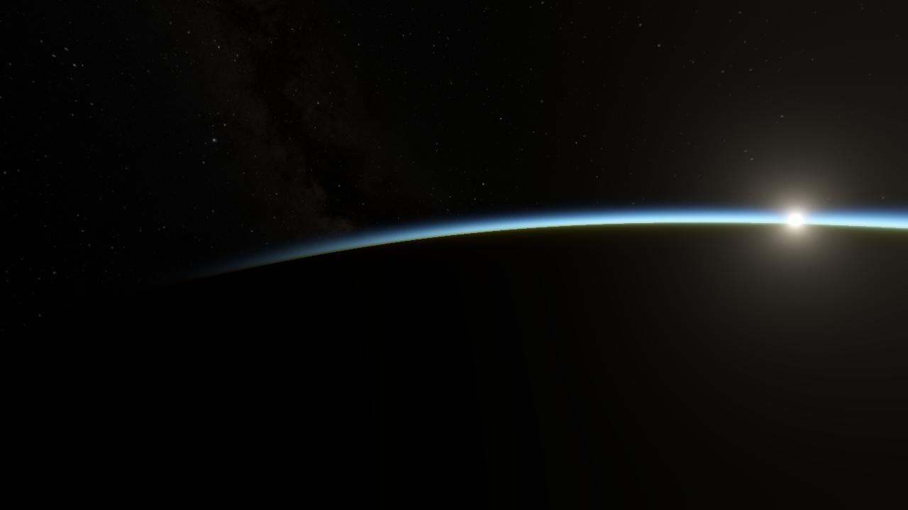

# PlanetShine



> Note: take a look at the other branches! :o)

Atmosphere and meshing playground. WIP.

**TODO:**

- [x] Actual atmosphere rendering.
- [x] Move the backend to vulkan (shouldn't be super hard).
- [ ] Orbits
  - [x] Elliptic orbits, propagation
  - [ ] Non-elliptic orbits untested.
- [ ] Terrain generation, textures.
  - [x] Textures.
  - [ ] Working on terrain in the [`terrain` branch](https://github.com/monomere/pshine/tree/terrain).
- [ ] Mesh LOD.
  - [x] Primitive sphere LODs.

## Setting Up

> requirements: git, wget, python, internet connection

```bash
git clone https://github.com/monomere/pshine --recurse-submodules --shallow-submodules
cd pshine
```

<!--
Do we need this??
Change `pshine/build.ninja` to work based on your platform (will automate later..)
```bash
cflags2 = -DVK_USE_PLATFORM_MACOS_MVK=1    # macos
cflags2 = -DVK_USE_PLATFORM_WAYLAND_KHR=1  # linux (change to X11)
cflags2 = -DVK_USE_PLATFORM_WIN32_KHR=1    # 
```
-->

### Script

> requirements: wget, python, ply

To install ply (needed for `dear_bindings`), do `python3 -m pip install --user ply` (or similar)

You can do the steps below manually, but there's a bash script that does them for you.
Make sure to check the contents of the script before running it.


> **NB:** if the script is different from the README, trust the script because I might've
> forgotten to update the README.

```bash
./setup.sh
```

<hr>

### Dependencies

The graphics backend uses:
- [`stb_image`](https://github.com/nothings/stb) for loading images
- [`volk`](https://github.com/zeux/volk) for loading Vulkan
- [`VMA`](https://github.com/GPUOpen-LibrariesAndSDKs/VulkanMemoryAllocator) for Vulkan memory allocation
- [`cgltf`](https://github.com/jkuhlmann/cgltf) for model loading

The game uses:
- [`clay`](https://raw.githubusercontent.com/nicbarker/clay) for UI layouting
- [`tomlc99`](https://github.com/cktan/tomlc99) for loading the configuration

So after cloning (only once):

```bash
wget -P pshine/include/vendor https://raw.githubusercontent.com/zeux/volk/master/volk.h
wget -P pshine/src/vendor https://raw.githubusercontent.com/zeux/volk/master/volk.c

wget -P pshine/include/vendor https://raw.githubusercontent.com/GPUOpen-LibrariesAndSDKs/VulkanMemoryAllocator/master/include/vk_mem_alloc.h

wget -P pshine/include/vendor https://raw.githubusercontent.com/nothings/stb/refs/heads/master/stb_image.h

wget -P pshine/include/vendor https://raw.githubusercontent.com/jkuhlmann/cgltf/refs/tags/v1.15/cgltf.h

wget -P pshine/include/vendor https://raw.githubusercontent.com/nicbarker/clay/refs/heads/main/clay.h

wget -P pshine/src/vendor https://raw.githubusercontent.com/cktan/tomlc99/refs/heads/master/toml.c
wget -P pshine/include/vendor https://raw.githubusercontent.com/cktan/tomlc99/refs/heads/master/toml.h
```

### Generating the ImGui bindings

The project uses [dear_bindings](https://github.com/dearimgui/dear_bindings) to generate c version of the c++ imgui headers.

```bash
mkdir -p pshine/src/vendor/cimgui/
mkdir    pshine/src/vendor/cimgui/backends/

python vendor/dear_bindings/dear_bindings.py \
  vendor/imgui/imgui.h \
  --imgui-include-dir imgui/ \
	--backend-include-dir imgui/backends/ \
	-t vendor/dear_bindings/src/templates \
	-o pshine/src/vendor/cimgui/cimgui

python vendor/dear_bindings/dear_bindings.py \
  --backend \
  --imgui-include-dir imgui/ \
	--backend-include-dir imgui/backends/ \
	--imconfig-path vendor/imgui/imgui.h \
	-t vendor/dear_bindings/src/templates \
	-o pshine/src/vendor/cimgui/backends/cimgui_impl_vulkan \
  vendor/imgui/backends/imgui_impl_vulkan.h

python vendor/dear_bindings/dear_bindings.py \
  --backend \
  --imgui-include-dir imgui/ \
	--backend-include-dir imgui/backends/ \
	--imconfig-path vendor/imgui/imgui.h \
	-t vendor/dear_bindings/src/templates \
	-o pshine/src/vendor/cimgui/backends/cimgui_impl_glfw \
  vendor/imgui/backends/imgui_impl_glfw.h
```

### Setting the Ninja platform variables


## Building

> requirements: ninja modern gcc-compatible c/c++ compiler, glfw, python (optional)

To build (incremental)
```bash
ninja
```

> If you edit generate_math.py, ninja will try to regenerate the
> [math.h](/pshine/src/pshine/math.h) header, which requires python.

> **NB:** by default, the build.ninja file uses the full LLVM setup
> with lld, clang, libc++, etc. To use the system-provided stuff
> change the first line in `build.ninja` to include `build.system.ninja`
> instead. Or make your own config if you want to (or need to)!

## Running

> requirements: vulkan ≥1.2 (i don't really know which version tho uhh)

**MacOS and MoltenVK:** If you installed MoltenVK and Vulkan through Homebrew,
add `VK_LAYER_PATH=/opt/homebrew/opt/vulkan-validationlayers/share/vulkan/explicit_layer.d`
to your environment (or maybe not idk).


```bash
build/pshine/main
```

Pass `-fullscreen` for fullscreen.

**Linux and X11:** By default pshine uses wayland, but you can pass `-x11` to use X11 instead.

### Controls

Key|Action
---|---
<kbd>F</kbd> | Switch camera mode (default is arcball)
<kbd>F2</kbd> | Hide all UI
<kbd>Shift+F2</kbd> | Only hide the debug windows

#### Ship Mode

Key|Action
---|---
<kbd>A</kbd>/<kbd>D</kbd> | Yaw
<kbd>W</kbd>/<kbd>S</kbd> | Pitch
<kbd>W</kbd>/<kbd>S</kbd> | Roll
<kbd>Shift</kbd>/<kbd>Ctrl</kbd> | Increase/decrease velocity

#### Arcball Mode

Key|Action
---|---
<kbd>A</kbd>/<kbd>D</kbd> | Rotate left/right (yaw)
<kbd>W</kbd>/<kbd>S</kbd> | Rotate up/down (pitch)
<kbd>X</kbd>/<kbd>Z</kbd> | Zoom in/out

#### Flycam Mode
Key|Action
---|---
<kbd>A</kbd>/<kbd>D</kbd> | Move left/right
<kbd>W</kbd>/<kbd>S</kbd> | Move forward/backward
<kbd>E</kbd>/<kbd>Q</kbd> | Move down/up
<kbd>&#8592;</kbd>/<kbd>&#8594;</kbd> | Rotate on global Y axis (yaw)
<kbd>&#8593;</kbd>/<kbd>&#8595;</kbd> | Rotate on local X axis (pitch)

## Credits

- Spaceship model by FilipZelinka, from [SketchFab](https://sketchfab.com/3d-models/spaceship-clipper-v2-red-menace-632da93e0e4c4ebab699ecb641803898). Under CC BY 4.0.

## TODO

- [x] Use double precision for position data and etc.
- [x] Fake perspective for celestial bodies.
- [x] Fixed point math?
- [x] Bug: ~~mesh scale is wrong~~ forgot to remove `* 5.0f` when passing atmosphere height.
- [x] ~~The bug is still there :(~~ ~~nevermind, it was correct all along.~~ ~~no, its still a bug....~~
  - [X] THE BUG IS FIXED IT WORKSSS (precision errors)
- [x] Separate materials for planets and meshes.
- [ ] Better API for materials? Maybe data-driven.
- [ ] Fix rotation matrices, and matrices in general.
  - [x] Kinda did it? I'm not sure.
- [ ] Rewrite the math library generation, its so ugly.
- [x] Stars
- [ ] Use near-origin coordinates for the "player".
- [ ] Velocity reference-frame.
- [ ] Clean up the renderer (`vk.c`), maybe move to C-ish C++ because its slowly
      becoming unbearable. Shouldn't be that much of a problem because you already need
      a C++ compiler for ImGui and VMA.
- [ ] Don't ignore `pshine_planet::has_atmosphere`.
- [x] Fix gizmo rendering on mac!

### Useful stuff

- [Unite 2013 - Building a new universe in Kerbal Space Program](https://www.youtube.com/watch?v=mXTxQko-JH0)
  how ksp does stuff!

# Resources

This isn't the full set of resources used unfortunately.

- [Survey of Efficient Representations for Independent Unit Vectors - Cigolle et al., 2014](https://jcgt.org/published/0003/02/01/)
- [Tangent Spaces and Diamond Encoding](https://www.jeremyong.com/graphics/2023/01/09/tangent-spaces-and-diamond-encoding/)
- https://stackoverflow.com/a/31662911/19776006
- https://gist.github.com/pezcode/1609b61a1eedd207ec8c5acf6f94f53a
- http://www.songho.ca/opengl/gl_projectionmatrix.html#perspective
- https://computergraphics.stackexchange.com/a/12453
- https://discourse.nphysics.org/t/reversed-z-and-infinite-zfar-in-projections/341/2
- https://playerunknownproductions.net/news/atmospheric-scattering
- https://paminerva.github.io/docs/LearnVulkan/02.F-Compute-Shader.html
- [Followup: Normal Mapping Without Precomputed Tangents](http://www.thetenthplanet.de/archives/1180)
- https://bgolus.medium.com/normal-mapping-for-a-triplanar-shader
- Textures: https://planetpixelemporium.com/
- Textures: https://svs.gsfc.nasa.gov/4720
- Textures: https://bjj.mmedia.is/
- https://github.com/Tw1ddle/Sky-Shader
- [Bevy Bloom Impl.](https://github.com/bevyengine/bevy/blob/main/crates/bevy_core_pipeline/src/bloom/bloom.wgsl)
- [The COD Post-processing slides](https://www.iryoku.com/next-generation-post-processing-in-call-of-duty-advanced-warfare/)
- https://github.com/expenses/bloom
- https://github.com/hatoo/blackbody
- https://www.corsix.org/content/higher-quality-random-floats
- https://dotat.at/@/2023-06-23-random-double.html
- https://en.wikipedia.org/wiki/Permuted_congruential_generator
- https://github.com/rkern/pcg64

- Amazing resource for orbital mechanics: [https://orbital-mechanics.space/](https://orbital-mechanics.space/)
- Vulkan discord
