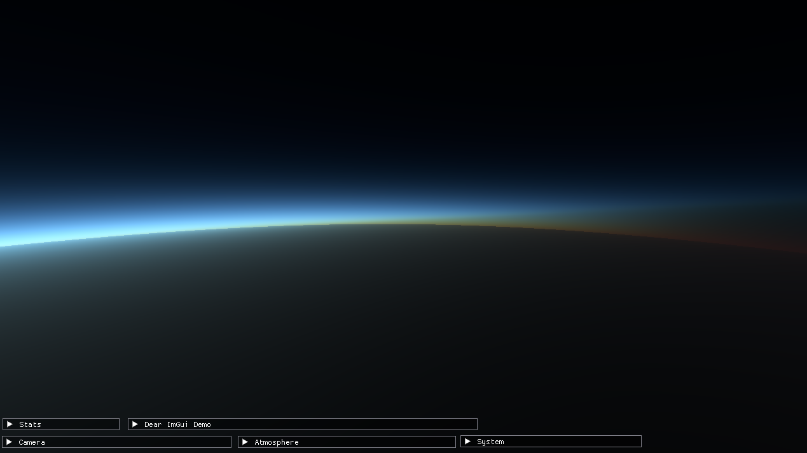

# PlanetShine



Atmosphere and meshing playground. WIP.

**TODO:**

- [x] Actual atmosphere rendering.
- [x] Move the backend to vulkan (shouldn't be super hard).
- [ ] Terrain generation, textures.
- [ ] Mesh LOD.

## Setting Up

> requirements: git, wget, python, internet connection

```bash
git clone https://github.com/monomere/pshine --recurse-submodules --shallow-submodules
cd pshine
```

> Note: when cloning, you might get an error that looks something like
>
> `fatal: Fetched in submodule path 'vendor/owl', but it did not contain <...>. Direct fetching of that commit failed.`
>
> You can ignore it; it's going to be fixed later and doesn't impact anything right now.

<!--
Do we need this??
Change `pshine/build.ninja` to work based on your platform (will automate later..)
```bash
cflags2 = -DVK_USE_PLATFORM_MACOS_MVK=1    # macos
cflags2 = -DVK_USE_PLATFORM_WAYLAND_KHR=1  # linux (change to X11)
cflags2 = -DVK_USE_PLATFORM_WIN32_KHR=1    # 
```
-->

### Script

> requirements: wget, python, ply

To install ply (needed for dear_bindings), do `python3 -m pip install --user ply` (or similar)

You can do the steps below manually, but there's a bash script that does them for you.
Make sure to check the contents of the script before running it.


> **NB:** if the script is different from the README, trust the script because I might've
> forgotten to update the README.

```bash
./setup.sh
```

<hr>

### Volk and VMA

The graphics backend uses [stb_image](https://github.com/nothings/stb), [volk](https://github.com/zeux/volk) and
[VMA](https://github.com/GPUOpen-LibrariesAndSDKs/VulkanMemoryAllocator),
so after cloning (only once):

```bash
wget -P pshine/include/vendor https://raw.githubusercontent.com/zeux/volk/master/volk.h
wget -P pshine/src/vendor https://raw.githubusercontent.com/zeux/volk/master/volk.c
wget -P pshine/include/vendor https://raw.githubusercontent.com/GPUOpen-LibrariesAndSDKs/VulkanMemoryAllocator/master/include/vk_mem_alloc.h
wget -P pshine/include/vendor https://raw.githubusercontent.com/nothings/stb/refs/heads/master/stb_image.h
```

### Patching owl

TBD. The shader language compiler (giraffe) uses [owl](https://github.com/ianh/owl), but it doesn't have a gitignore and
doesn't prefix some of the symbols in the generated header. Giraffe is currently in development so this doesn't matter.

### Generating the ImGui bindings

The project uses [dear_bindings](https://github.com/dearimgui/dear_bindings) to generate c version of the c++ imgui headers.

```bash
mkdir -p pshine/src/vendor/cimgui/
mkdir    pshine/src/vendor/cimgui/backends/

python vendor/dear_bindings/dear_bindings.py \
  vendor/imgui/imgui.h \
  --imgui-include-dir imgui/ \
	--backend-include-dir imgui/backends/ \
	-t vendor/dear_bindings/src/templates \
	-o pshine/src/vendor/cimgui/cimgui

python vendor/dear_bindings/dear_bindings.py \
  --backend \
  --imgui-include-dir imgui/ \
	--backend-include-dir imgui/backends/ \
	--imconfig-path vendor/imgui/imgui.h \
	-t vendor/dear_bindings/src/templates \
	-o pshine/src/vendor/cimgui/backends/cimgui_impl_vulkan \
  vendor/imgui/backends/imgui_impl_vulkan.h

python vendor/dear_bindings/dear_bindings.py \
  --backend \
  --imgui-include-dir imgui/ \
	--backend-include-dir imgui/backends/ \
	--imconfig-path vendor/imgui/imgui.h \
	-t vendor/dear_bindings/src/templates \
	-o pshine/src/vendor/cimgui/backends/cimgui_impl_glfw \
  vendor/imgui/backends/imgui_impl_glfw.h
```

## Building

> requirements: ninja modern gcc-compatible c/c++ compiler, glfw, python (optional)

To build (incremental)
```bash
ninja
```

> If you edit generate_math.py, ninja will try to regenerate the
> [math.h](/pshine/src/pshine/math.h) header, which requires python.

> **NB:** by default, the build.ninja file uses the full LLVM setup
> with lld, clang, libc++, etc. To use the system-provided stuff
> change the first line in `build.ninja` to include `build.system.ninja`
> instead. Or make your own config if you want to (or need to)!

## Running

> requirements: vulkan ≥1.2 (i don't really know which version tho uhh)

```bash
build/pshine/main
```

**Linux and X11:** By default pshine uses wayland, but you can pass `-x11` to use X11 instead.

The planet has a radius of 6371km (Earth), the atmosphere has a height of 100km, and the camera moves at 500km/s by default.

### Controls

Key|Action
---|---
<kbd>F</kbd> | Switch camera mode (default is arcball)

#### Arcball Mode

Key|Action
---|---
<kbd>A</kbd>/<kbd>D</kbd> | Rotate left/right (yaw)
<kbd>W</kbd>/<kbd>S</kbd> | Rotate up/down (pitch)
<kbd>X</kbd>/<kbd>Z</kbd> | Zoom in/out

#### Flycam Mode
Key|Action
---|---
<kbd>A</kbd>/<kbd>D</kbd> | Move left/right
<kbd>W</kbd>/<kbd>S</kbd> | Move forward/backward
<kbd>Shift</kbd>/<kbd>Space</kbd> | Move down/up

## TODO

- [x] Use double precision for position data and etc.
- [x] Fake perspective for celestial bodies.
- [x] Fixed point math?
- [x] Bug: ~~mesh scale is wrong~~ forgot to remove `* 5.0f` when passing atmosphere height.
- [x] ~~The bug is still there :(~~ ~~nevermind, it was correct all along.~~ ~~no, its still a bug....~~
  - [X] THE BUG IS FIXED IT WORKSSS (precision errors)
- [ ] Fix rotation matrices, and matrices in general.
- [ ] Rewrite the math library generation, its so ugly.
- [ ] Stars
- [ ] Use near-origin coordinates for the "player".
- [ ] Velocty reference-frame.

### Useful stuff

- [Unite 2013 - Building a new universe in Kerbal Space Program](https://www.youtube.com/watch?v=mXTxQko-JH0)
  how ksp does stuff!

# Resources

This isn't the full set of resources used unfortunately.

- [Survey of Efficient Representations for Independent Unit Vectors - Cigolle et al., 2014](https://jcgt.org/published/0003/02/01/)
- [Tangent Spaces and Diamond Encoding](https://www.jeremyong.com/graphics/2023/01/09/tangent-spaces-and-diamond-encoding/)
- https://stackoverflow.com/a/31662911/19776006
- https://gist.github.com/pezcode/1609b61a1eedd207ec8c5acf6f94f53a
- http://www.songho.ca/opengl/gl_projectionmatrix.html#perspective
- https://computergraphics.stackexchange.com/a/12453
- https://discourse.nphysics.org/t/reversed-z-and-infinite-zfar-in-projections/341/2
- https://playerunknownproductions.net/news/atmospheric-scattering
- https://paminerva.github.io/docs/LearnVulkan/02.F-Compute-Shader.html
- [Followup: Normal Mapping Without Precomputed Tangents](http://www.thetenthplanet.de/archives/1180)
- https://bgolus.medium.com/normal-mapping-for-a-triplanar-shader
- Textures: https://planetpixelemporium.com/earth8081.html
